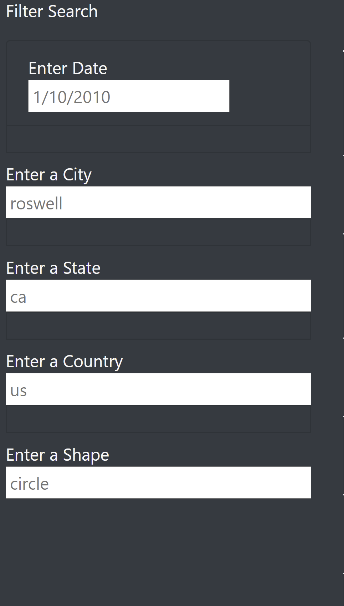

# UFO Sightings
## Overview of Project
The purpose of the project was to create an interactive webpage that allows individuals to parse the data around UFO sightings. Therefore, two things needed to be built: the webpage that allows users to view the data (HTML) and a dynamic table that presents it (JavaScript).  The end product provides a more in-depth analysis of UFO sightings by allowing users to filter for multiple criteria at the same time. In addition to the date, users may filter by the city, state, country, and shape.

## Results
Once a user is on the webpage, they may filter the data using the filters on the left hand side of the webpage. The user may filter by date, city, state, country, and/or shape as they wish. There are placeholders in each so that the user may see the format of input.  The user may type in one, two, three, four, or all five fields to sort the data. Each time they enter data into a field, they can populate the results by either using the "Tab" key or "Enter" key.
### Filters

#### City Filter Example

### State Filter Example

## Summary
### Drawback
This new design has a lot of great features; however, there is one drawback.  
### Additional Recommendations for Further Development
One additional recommendation for further development is ### because###.  An additional recommendation would be to ####.

